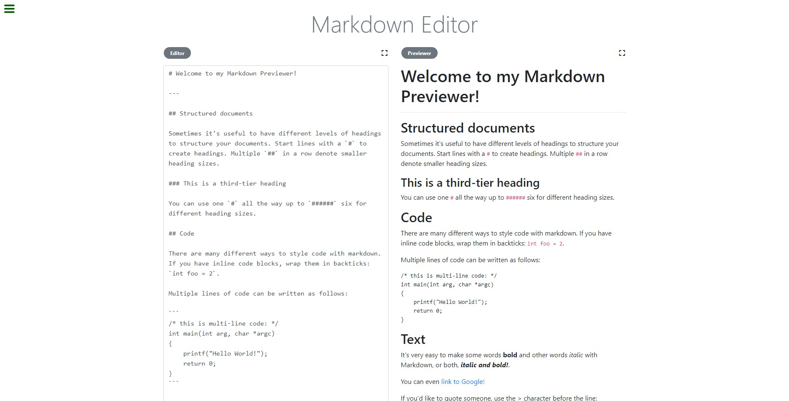
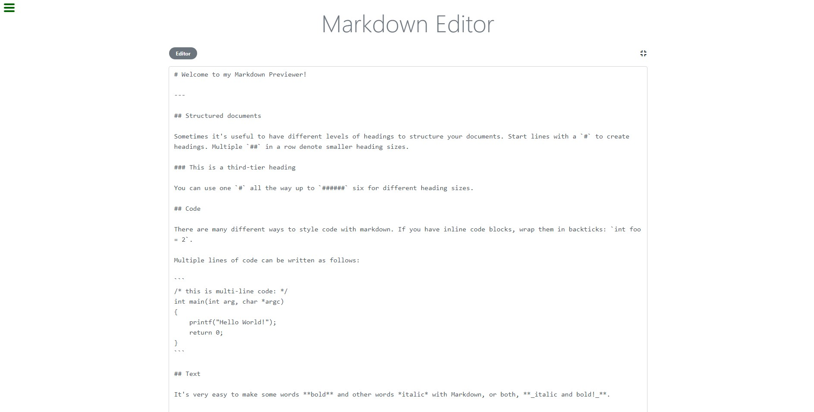
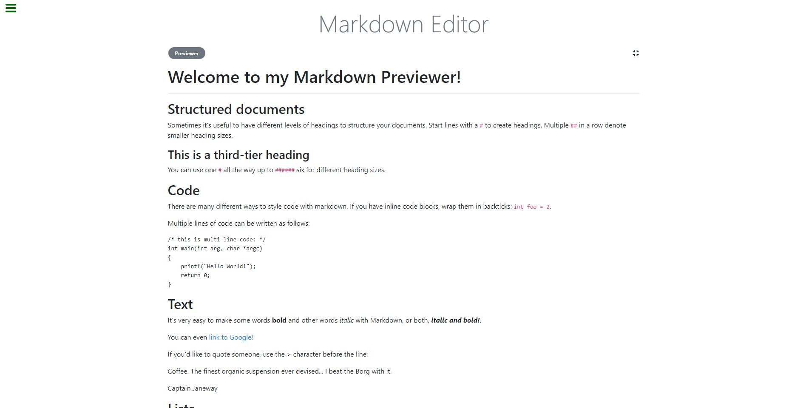
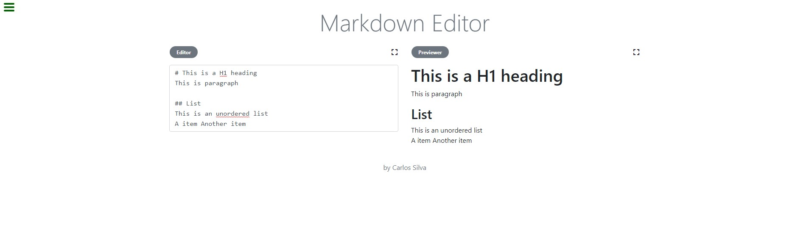

# FreeCodeCamp -Markdown Previewer
This is part of Free Code Camp curriculum, Front End Libraries Projects - Build a Markdown Previewer.

You can see the project page in [freeCodeCamp](https://learn.freecodecamp.org/front-end-libraries/front-end-libraries-projects/build-a-markdown-previewer/),
also you can view it in [codepen](https://codepen.io/xinthauro/full/ErVPOR).

## Screenshots

